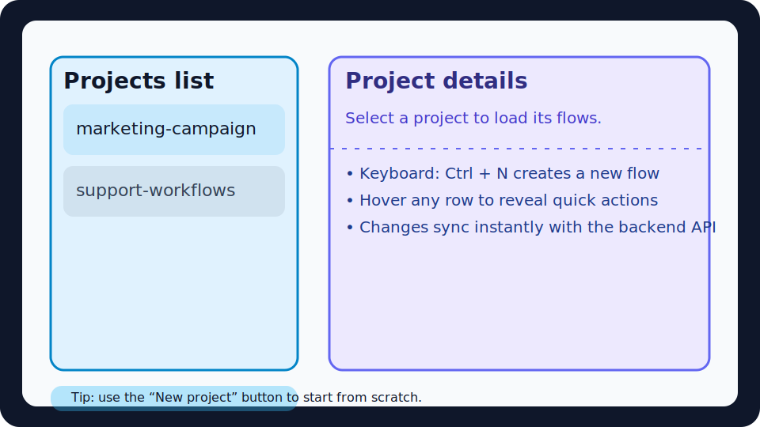
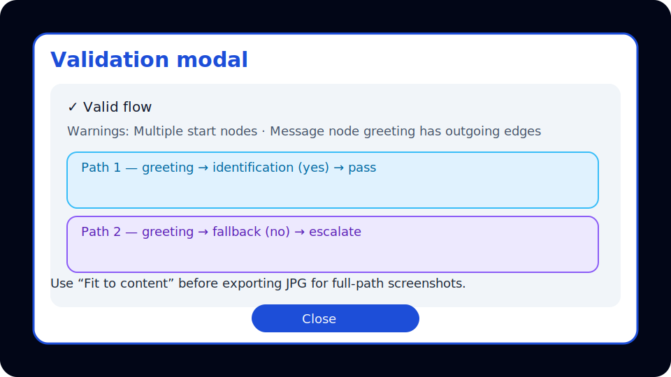

# IA Data Copilot — Flow Orchestration Suite

This repository now bundles a **Flask backend** and a **React + React Flow frontend** for designing and validating orchestration graphs. The system keeps the original CrewAI agents and data copilot features while exposing a dedicated workflow builder that can export validated YAML definitions and JPG previews.



## Architecture

```
.
├── backend/              # Flask API, storage layer, validation + YAML export
│   ├── api/              # REST blueprints for projects, flows, validation, export
│   ├── core/             # Domain models, validation routines, storage helpers
│   ├── storage/          # JSON persistence (projects + flows)
│   └── tests/            # Pytest suite covering validation and YAML output
├── data-copilot/         # Legacy CrewAI orchestration stack
├── frontend/             # Vite + React + TypeScript editor
│   ├── components/       # Flow canvas, inspector, modal dialogs
│   ├── lib/              # API wrappers, schema types, Zustand store
│   └── pages/            # Projects, flows, and editor routes
└── docs/                 # Reference documentation and illustrated guides
```

Key backend modules:

- `backend/core/validation.py` builds inbound/outbound edge maps, enforces unique IDs, detects unknown references, cycles, dangling labels, and enumerates all root → terminal message paths (with a configurable max depth safeguard).
- `backend/core/yaml_export.py` converts a `FlowModel` into a deterministic, human-friendly YAML document using `ruamel.yaml` with ordered keys and preserved metadata.
- `backend/tests/` contains regression coverage for validation edge cases (cycles, orphan edges, label mismatches) and YAML serialization snapshots.

Key frontend modules:

- `frontend/src/pages/EditorPage.tsx` wires the Zustand store, React Flow canvas, inspector sidebars, validation modal, and export actions (YAML + JPG).
- `frontend/src/components/HeaderBar.tsx` exposes toolbar commands with a **Fit to content** toggle that tightens the viewport before generating JPG exports.
- `frontend/src/lib/yamlPreview.ts` renders a client-side YAML preview that mirrors the backend exporter structure for instant feedback.


## Installation

### Backend (Python 3.11+)

```bash
python -m venv .venv
source .venv/bin/activate
pip install --upgrade pip
pip install -r backend/requirements.txt
pip install -r data-copilot/requirements.txt  # CrewAI stack
```

### Frontend (Node 18+)

```bash
cd frontend
npm install
```

> **Note:** If your npm registry enforces SSO, configure the registry URL first (`npm config set registry <url>`). All dependencies are MIT-compatible.

## Running locally

### Backend

```bash
# Activate your virtualenv first
export FLASK_APP=backend/app.py
export FLASK_ENV=development
python -m flask run --app backend.app --port 5000
```

The API will serve under `http://127.0.0.1:5000/api` with CORS enabled for the default Vite origin.

### Frontend

```bash
cd frontend
npm run dev -- --host 0.0.0.0 --port 5173
```

The editor reads the backend base URL from `VITE_API_BASE_URL` (default `http://localhost:5000/api`).

## Docker workflows

Both layers ship individual Dockerfiles for streamlined container builds:

```bash
# Backend
cd backend
docker build -t copilot-backend .
docker run --rm -p 5000:5000 -v $(pwd)/storage:/app/storage copilot-backend

# Frontend
cd frontend
docker build -t copilot-frontend .
docker run --rm -p 5173:5173 copilot-frontend
```

Mounting `backend/storage` is optional but recommended to persist project JSON files.

## Testing

```bash
# Backend validation + YAML exporter
pytest backend/tests

# Type checks & build smoke test
cd frontend
npm run lint
npm run build
```



## Keyboard shortcuts

| Shortcut | Action |
| --- | --- |
| **Ctrl/Cmd + S** | Save current flow (runs quick client-side validation first) |
| **Ctrl/Cmd + E** | Trigger full backend validation and open the results modal |
| **Ctrl/Cmd + J** | Export YAML via the backend exporter |
| **Ctrl/Cmd + P** | Export JPG (optionally fitting the viewport to graph content) |
| **Ctrl/Cmd + N** | Create a new flow from the Projects page |

Additional canvas gestures: pan with mouse drag, zoom with wheel, snap-to-grid on drag, auto-layout via toolbar.

## Known limitations

- The sample `backend/storage/projects.json` seeds a minimal catalogue; provide your own fixture or production storage path for real deployments.
- html2canvas runs fully client-side. For very large graphs you may need to increase browser memory or export in segments.
- BigQuery and Vertex AI credentials remain required for the original CrewAI orchestration pipeline; consult `data-copilot/README.md` for detailed setup.

For a detailed REST API and schema specification consult [`API.md`](API.md) and [`SCHEMA.md`](SCHEMA.md).
